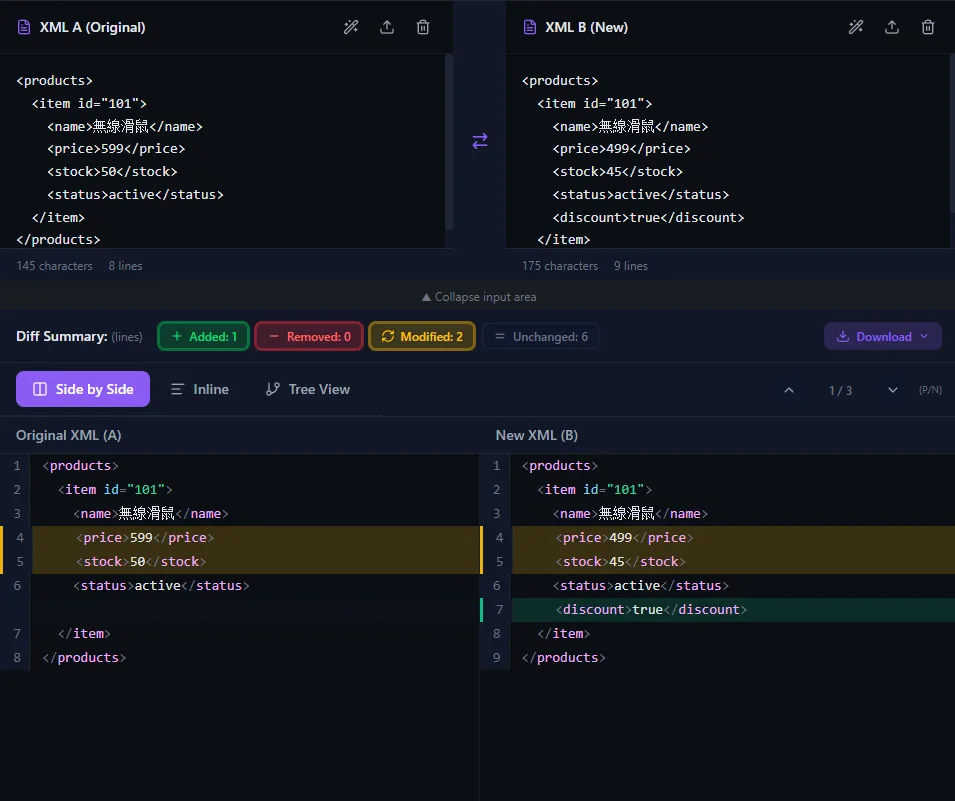
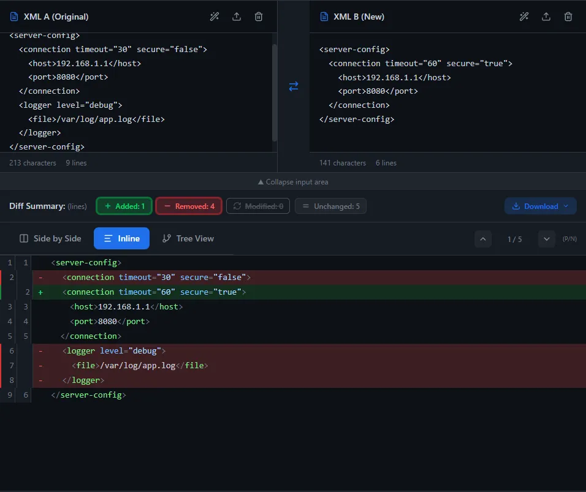
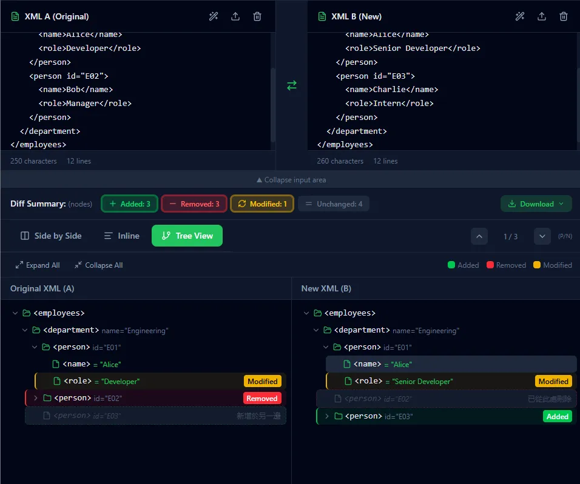

# XML Diff Tool

**English** | [Traditional Chinese](README.zh-TW.md) | [Simplified Chinese](README.zh-CN.md)

A pure frontend XML comparison tool that visually presents differences between two XML documents. All processing happens locally in the browser.

<div style="display: flex; gap: 12px; align-items: center;">
  
  
  
</div>

## Features

- Single File and Batch Compare modes
- Four view modes: Side by Side, Inline (Unified Diff), Tree View, and Schema
- Mode picker shows short labels with per-mode recommendations (Side = left/right, Inline = unified, Tree = structure, Schema = table/field)
- Schema view with table/field diff, presets (Struct/Entry, XSD, Table/Column), and custom templates
- Validation warnings with strict mode toggle; click warning jumps to the offending lines/fields (also works for single-file parse)
- Inspect/Parse mode with precise line/field jump and contextual snippet; staged scrolling for large files
- Large file mode
  - Per-side preview for large inputs
  - Optional full rendering toggle
  - Reduced rendering and syntax highlighting for performance
  - Line diff computed in a Web Worker with safe fallback for huge inputs
- Diff filters, summary, and navigation
- Drag and drop upload, swap, and XML formatting
- Mode-specific diff reports (HTML/Text) for Side by Side, Inline, Tree, and Schema
- Coverage-based overview modes with chunk list navigation
- Themes and multi-language UI

## View Mode Guide

- Side by Side: precise line-by-line checks with synced scrolling
- Inline: compact added/removed list (no "Modified")
- Tree View: structural changes and hierarchy shifts
- Schema: table/field definitions and metadata changes

## Validation & Inspect

- Warnings: catch text outside tags, illegal characters, and malformed nodes; “Strict mode” enforces hard validation.
- Jump & highlight: clicking a warning expands Inspect mode, scrolls to the exact lines/fields, and highlights the snippet (works in diff and single-file).
- Large files: jump uses staged scrolling to stay accurate in large-file mode.

## Common Misconceptions

- Side by Side / Inline require both XML A and XML B to be present
- Inline view does not show "Modified"; it splits into removed + added
- Schema view focuses on structure, not line-level diff

## Large File Notes

- Large inputs default to preview mode on that side.
- Use "Show full content" to expand a large input.

## Tech Stack

- React 19 + TypeScript
- Vite
- Tailwind CSS v4
- Lucide React

## Development

```bash
# Install dependencies
npm install

# Start development server
npm run dev

# Build for production
npm run build
```

## Deployment (GitHub Pages)

- GitHub Actions builds and deploys `dist` to Pages.
- In repo settings, set Pages Source to "GitHub Actions".
- Site URL: https://adalf0722.github.io/xml_diff_tool/

## Privacy

All XML processing is done locally in the browser. No data is uploaded to any server.

## License

MIT
