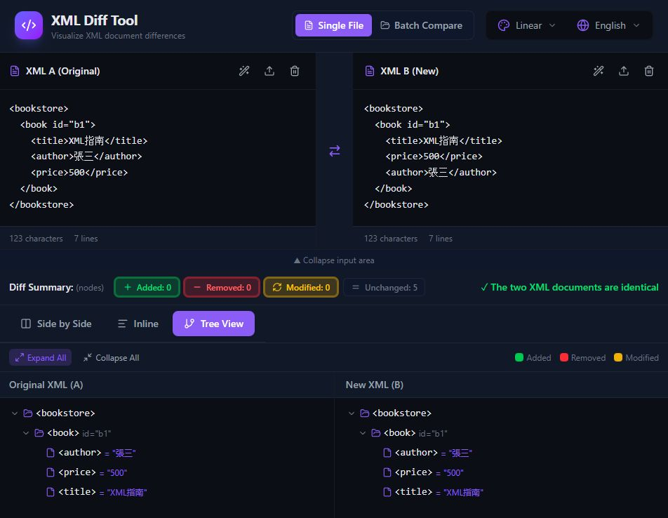

# XML Diff Tool Test Report and Comparison Logic Manual

This manual explains, through concrete test cases, how **XML Diff Tool** handles data differences from different perspectives. It helps users choose the most suitable comparison mode based on their needs (e.g., code review or data logic validation).

---

## Core Test Case: Nested Structure Object Replacement

This case simulates a typical employee data change: `Alice` is promoted, while `Bob` leaves and is replaced by the new hire `Charlie`.

### Source XML (A)
```xml
<employees>
  <department name="Engineering">
    <person id="E01">
      <name>Alice</name>
      <role>Developer</role>
    </person>
    <person id="E02">
      <name>Bob</name>
      <role>Manager</role>
    </person>
  </department>
</employees>

```

### Target XML (B)

```xml
<employees>
  <department name="Engineering">
    <person id="E01">
      <name>Alice</name>
      <role>Senior Developer</role>
    </person>
    <person id="E03">
      <name>Charlie</name>
      <role>Intern</role>
    </person>
  </department>
</employees>

```

---

## Three View Logic Analysis

Based on the test results, the tool provides three different interpretations for the same XML changes:

### 1. Side-by-Side View

* **Core logic**: Line-based text alignment (Line-based Text Diff).
* **Presentation**: The changed block is highlighted in **yellow (modified)**.
* **Analysis**: The tool aligns tag positions on both sides. When the structure position is the same (e.g., list item 2), it tends to treat the change as a ?content update,? which is suitable for quickly checking minor textual edits.

### 2. Inline View

* **Core logic**: Unified Diff.
* **Presentation**: **Red (-)** indicates removal, **green (+)** indicates addition.
* **Analysis**: This mode treats changes as a continuous process of ?old line removed, new line inserted,? matching the reading habits of version control systems (e.g., Git) and clearly showing the before/after text flow.

### 3. Tree View

* **Core logic**: Semantic / node-based diff.
* **Presentation**:
* **Yellow (modified)**: Marks changes to a single attribute or value (e.g., Alice?s role).
* **Red (removed)**: Marks the entity removed (e.g., Bob with `id="E02"`).
* **Green (added)**: Marks the new entity added (e.g., Charlie with `id="E03"`).


* **Analysis**: **This is the most precise data comparison mode**. It understands semantics and distinguishes ?object replacement? from ?text modification.?

---

## Ultimate Test: Node Reordering (Reordering)



When the XML content is identical and only the order of child nodes (e.g., <author> and <price>) is swapped:

* Tree View result: shows ?the two XML documents are identical.?
* Technical advantage: proves the tool can parse the DOM structure and ignore irrelevant ordering, ensuring data logic consistency.

--- 

## Overall Summary

| Comparison Mode | Decision Logic | Detection Depth | Best Use Case |
| --- | --- | --- | --- |
| **Side-by-Side** | Text alignment | Surface text | Code formatting checks, quick parameter verification |
| **Inline** | Line-based update | Text flow | Code review |
| **Tree View** | Node-level semantics | Logical structure | **Data sync verification, API schema validation** |

---
